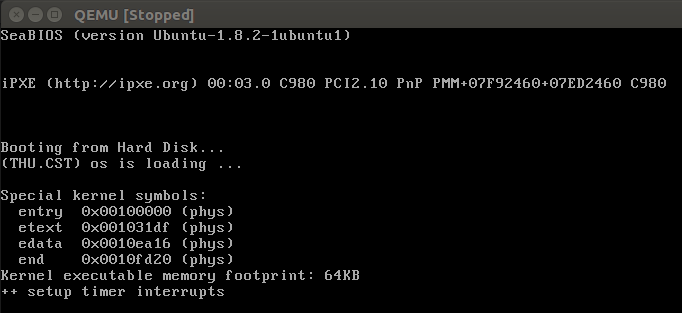

# lab1

## exam1

**1.操作系统镜像文件ucore.img是如何一步一步生成的?(需要比较详细地解释Makefile中每一条相关命令和命令参数的含义，以及说明命令导致的结果)**

**2.一个被系统认为是符合规范的硬盘主引导扇区的特征是什么?**

512个字节，最后两个字节是0x55和0xAA，见`tools/sign.c`

## exam2

**1.从CPU加电后执行的第一条指令开始，单步跟踪BIOS的执行。**

* 设置architecture 为i8086

  `/tools/gdbinit`文件加入，设置架构为i8086，gdb和qemu直接通过网络端口1234通信：

  ```
  set architecture i8086
  target remote :1234
  ```

* 开始debug

  `make debug`，程序一开始就进入等待状态。可以看到进入到了`kern/init/init.c`文件的`kern_init`函数。地址是`0x100000`。

* debug单步指令

  ```
  si      单步执行
  next	单步到程序源代码的下一行,不进入函数。
  nexti	单步一条机器指令,不进入函数。
  step	单步到下一个不同的源代码行(包括进入函数)。
  stepi	单步一条机器指令。
  ```

  **解答：**逐步输入`next`，QEMU界面会一步一步打印BIOS加载Bootloader的过程。

  	

  

**2.在初始化位置0x7c00设置实地址断点，测试断点正常。**

BIOS将Bootloader搬运到了`0x7c00`，程序再从此地址开始运行。

* 设置断点

  gdb中输入`b *[地址]`来设置特定断点当qemu中的cpu执行到指定地址时，便会将控制权交给gdb：

  `b *0x7c00`

  `continue`

  还可以输入`x /10i 0x7c00`来查看汇编指令。

**3.从0x7c00开始跟踪代码运行，将单步跟踪反汇编得到的代码与bootasm.S和bootblock.asm进行比较。**

* 在gdbinit中加入反汇编参数

  ```
  define	hook-stop
  x/i	$pc
  end
  ```

* 开始debug

  `make debug`

* 设置断点

  ```
  b *0x7c00
  continue
  ```

  可以看到大部分和`bootasm.S`内容相同，但是普遍没有`bootasm.S`的`w`，如`bootasm.S`中的`xorw %ax, %ax`，反汇编后是`xor %ax, %ax`。movl的l用于32位的字值，movw的w用于16位的字值，movb的b用于8位的字值。

  

**4.自己找一个bootloader或内核中的代码位置，设置断点并进行测试。**

## exam3

**BIOS将通过读取硬盘主引导扇区到内存,并转跳到对应内存中的位置执行bootloader。请分析bootloader是如何完成从实模式进入保护模式的。**

* 为何开启A20,以及如何开启A20

  寻址寄存器`segent:offset<(0xffff左移4位+0xffff)=1088KB`，最多可访问1088KB空间，比1MB大了一些。为了保持向下兼容，需要设置第20位（A20）地址一直为0，这样才能实现不超过1MB。在进入保护模式后，需要使用这一位（A20），又要打开使能这一位。

  http://hengch.blog.163.com/blog/static/107800672009013104623747/

* 如何初始化GDT表

  初始化GDT表：一个简单的GDT表和其描述符已经静态储存在引导区（asm.h）中，载入即可

  ```assembly
  lgdt gdtdesc
  ```

  

* 如何使能和进入保护模式

  控制寄存器cr0的第0位PE置1，可以开启保护模式。

  ```assembly
  movl %cr0, %eax             # cr0 ： 控制寄存器0
  orl $CR0_PE_ON, %eax        # CR0_PE_ON = 0x01，和cr0的数值或操作，即第0位（PE：CR0的位0是启用保护（Protection Enable）标志）置1
  movl %eax, %cr0             # 给cr0赋值，启动保护模式
  ```

## exam4

通过阅读bootmain.c,了解bootloader如何加载ELF文件。通过分析源代码和通过qemu来运行并调试bootloader和OS,

* bootloader如何读取硬盘扇区的?

  bootloader就是`bin/bootblock`会加入到`ucore.img`中。bootblock只有512字节，作用是将操作系统加载到内存中。下面是具体的过程：

  1.进行一些初始化操作（bootblock），后面会调用bootmain函数（步骤2-5）

  2.读取EFLHDR

  2.验证ELFHDR，通过`e_magic`这个成员变量

  3.获取`program header`（ph）及其终止地址

  4.以SECTSIZE为单位，逐步读取代码

  5.通过ELFHDR的`e_entry`成员变量指向的地址，执行代码

* bootloader是如何加载ELF格式的OS?

  上一个问题的2-5步。

## exam5

```
....
ebp:0x00007b28	eip:0x00100992	args:0x00010094	0x00010094	0x00007b58	0x00100096
				kern/debug/kdebug.c:305:	print_stackframe+22
ebp:0x00007b38	eip:0x00100c79	args:0x00000000	0x00000000	0x00000000	0x00007ba8
				kern/debug/kmonitor.c:125:	mon_backtrace+10
ebp:0x00007b58	eip:0x00100096	args:0x00000000	0x00007b80	0xffff0000	0x00007b84
				kern/init/init.c:48:	grade_backtrace2+33
ebp:0x00007b78	eip:0x001000bf	args:0x00000000	0xffff0000	0x00007ba4	0x00000029
				kern/init/init.c:53:	grade_backtrace1+38
ebp:0x00007b98	eip:0x001000dd	args:0x00000000	0x00100000	0xffff0000	0x0000001d
				kern/init/init.c:58:	grade_backtrace0+23
ebp:0x00007bb8	eip:0x00100102	args:0x0010353c	0x00103520	0x00001308	0x00000000
				kern/init/init.c:63:	grade_backtrace+34
ebp:0x00007be8	eip:0x00100059	args:0x00000000	0x00000000	0x00000000	0x00007c53
				kern/init/init.c:28:	kern_init+88
ebp:0x00007bf8	eip:0x00007d73	args:0xc031fcfa	0xc08ed88e	0x64e4d08e	0xfa7502a8
<unknow>:	--	0x00007d72	–
....
```

打印栈帧的函数:

```c
void print_stackframe(void) {
     /* LAB1 YOUR CODE : STEP 1 */
     /* (1) call read_ebp() to get the value of ebp. the type is (uint32_t);
      * (2) call read_eip() to get the value of eip. the type is (uint32_t);
      * (3) from 0 .. STACKFRAME_DEPTH
      *    (3.1) printf value of ebp, eip
      *    (3.2) (uint32_t)calling arguments [0..4] = the contents in address (uint32_t)ebp +2 [0..4]
      *    (3.3) cprintf("\n");
      *    (3.4) call print_debuginfo(eip-1) to print the C calling function name and line number, etc.
      *    (3.5) popup a calling stackframe
      *           NOTICE: the calling funciton's return addr eip  = ss:[ebp+4]
      *                   the calling funciton's ebp = ss:[ebp]
      */
    uint32_t ebp = read_ebp();uint32_t eip = read_eip();
    uint32_t i,j;
    for(i = 0;i < STACKFRAME_DEPTH;i++){
        cprintf("ebp:0x%08x eip:0x%08x args:", ebp,eip);
        // (uint32_t *)ebp + 2 数值上等于 (u8 *)ebp + 4
        uint32_t * args = (uint32_t *)ebp + 2;
        for(j = 0;j < 4;j++){
            cprintf("0x%08x ",args[j]);
        }
        cprintf("\n");
        print_debuginfo(eip-1);
        eip = * ((uint32_t *)ebp + 1);
        ebp = * ((uint32_t *)ebp);
        // eip = ((uint32_t *)ebp)[1];
        // ebp = ((uint32_t *)ebp)[0];
    } 
}
```

```
pushl			%ebp
movl			%esp	,	%ebp
调用函数前，都会调用以上汇编指令，保存上一个ebp，并将ebp指向现在的栈顶

高地址 |    栈底    |   
      |    ...    |
      |    ...    |
      |    参数3   |
      |    参数2   |
      |    参数1   |
      |  返回地址   |
      |  上层[ebp] |  <---- [ebp]
低地址 |  局部变量   |
```